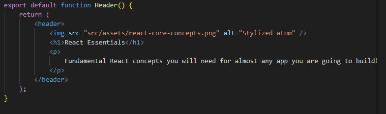
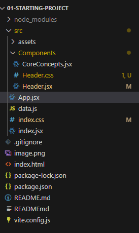
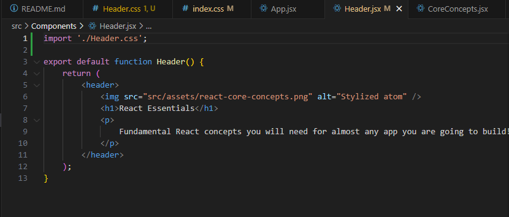
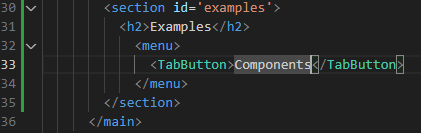
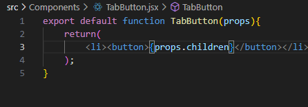
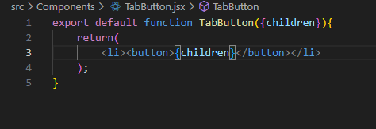

What are react apps?
> React apps are build by combining the components 

Advantages!
> Reusable building blocks 
> Related code lives together (related HTML, CSS, JS)
> Seperation of concerns (different components handle different data and logic)

<h1>Exporting and importing in JS</h1>


index.js
```js
//Named inline export 
export const myObject = {
  name: "John",
  age: 30,
  city: "New York"
};

//Named default inline export 
export const myObject1 = {
  name: "John",
  age: 30,
  city: "New York"
};

```

app.js
```js
import {myObject} from './index.js'; // names import 
import Object from './index.js'; // default import .
```

<h1>Starting the project</h1>

>link to download starting project > https://github.com/academind/react-complete-guide-course-resources/blob/main/attachments/03%20React%20Essentials/01-starting-project.zip

>After downloading and extracting the folder we need to run (npm install) to install all required packages.

>After installing use command (npm run dev) to start the project and (control c) to exit the dev env

<h1>JSX and React Components </h1>

> JSX is a javascript syntax extension. It is used to describe and create HTML elements in JavaScript in a declarative way. 

> This feature is not supported by the browser. It is transformed behind the scenes to a code that is compatible with the browser by the development servers.  

> Component Function must follow this rule 
    >Name starts with uppercase 
    > Returns renderable content

<h1>Creating custome components </h1>

> This is App.jsx file, the file initially had function App. We have added function Header to segregate the content and the header content is moved into this function.

> In the belowe example the component Header and App are stored in a same file 

```jsx
function Header(){
    return (<header>
        
        <h1>React Essentials</h1>
        <p>
        Fundamental React concepts you will need for almost any app you are
        going to build!
        </p>
    </header>);
}
      
function App() {
  return (
    <div>
      <!-- <header>
        
        <h1>React Essentials</h1>
        <p>
          Fundamental React concepts you will need for almost any app you are
          going to build!
        </p>
      </header> -->
      //here we have used the newly made component Header
      <Header/> // or we can also write it as <Header></Header>
      <main>
        <h2>Time to get started!</h2>
      </main>
    </div>
  );
}

export default App;
```

<h1>How to handle Components and How it builds a component tree </h1>

> index.jsx file is the first file loaded by the HTML file in the browser (here is where the react app boots up)
> this index.jsx file will inject the root component that is (App.jsx) into the index.html. And the nested components are rendered inside App.jsx. 

    #Built-in component 
        >name starts with lowercase charecter

    #Custom components 
        >name starts with uppercase charecter 
        >React will traverse the component tree until it has only build-in components

<h1>Using and outputting values</h1> 
> we ca use {} to dynamically output the values
> we can write js code inside this bracket 
> For example 

```jsx 
<header>
        
        <h1>React Essentials{Math.floor(Math.random()*(10))}</h1> /// here we have dynamically injected value into h1 using {}
        <p>
        Fundamental React concepts you will need for almost any app you are
        going to build!
        </p>
    </header>
```

<h1>Setting HTML Attributes Dynamically & Loading Image Files</h1>

if we import images like this 

```HTML

``` 

them this might give raise to issue durign the deployment. 

Insted we can import the image *Example* 
```jsx 
import reactImg from './assets/react-core-concepts.png'


```
Here reactImg is an js object that will point to the image address 


<h1>Making Components Reusable with Props [Core Concept]</h1>

React allows us to pass data to components via a concept called *props*

This is how we can pass the parameters to the component 

```jsx
import { CORE_CONCEPTS } from './data';
const reactDescriptions = ['Fundamental', 'Crucial', 'Core'];

function genRandomInt(max) {
  return Math.floor(Math.random() * (max + 1));
}

function Header() {
  return (
    <header>
      
      <h1>React Essentials</h1>
      <p>
        Fundamental React concepts you will need for almost any app you are going to build!
      </p>
    </header>
  );
}

function CoreConcepts(props){
  return (
    <li>
      
      <h3>{props.title}</h3>
      <p>{props.description}</p>
    </li>
  );
}

function App() {
  return (
    <div>
      <Header />
      <main>
        <section id='core-concepts'>
          <h2>Core Comcepts</h2>
          <ul>
            <CoreConcepts 
            title={CORE_CONCEPTS[0].title} 
            description={CORE_CONCEPTS[0].description} 
            image={CORE_CONCEPTS[0].image} // this is non smart way of passing the vlues 
            />
            <CoreConcepts {...CORE_CONCEPTS[1]}/> // here we can destructure the object so that the properties will get pass 
            <CoreConcepts {...CORE_CONCEPTS[2]}/> // however property name inside the component should be same as prop of object passed
            <CoreConcepts {...CORE_CONCEPTS[3]}/>
          </ul>
        </section>
      </main>
    </div>
  );
}

export default App;
```

**This is the js file**

```js
import componentsImg from './assets/components.png';
import propsImg from './assets/config.png';
import jsxImg from './assets/jsx-ui.png';
import stateImg from './assets/state-mgmt.png';

export const CORE_CONCEPTS = [
  {
    image: componentsImg,
    title: 'Components',
    description:
      'The core UI building block - compose the user interface by combining multiple components.',
  },
  {
    image: jsxImg,
    title: 'JSX',
    description:
      'Return (potentially dynamic) HTML(ish) code to define the actual markup that will be rendered.',
  },
  {
    image: propsImg,
    title: 'Props',
    description:
      'Make components configurable (and therefore reusable) by passing input data to them.',
  },
  {
    image: stateImg,
    title: 'State',
    description:
      'React-managed data which, when changed, causes the component to re-render & the UI to update.',
  },
];
```

**Here is how we can destructure the component parameter**

```jsx
function CoreConcepts({image, description="lorem ipsum", title}){ // description is set to a default value 
  return (
    <li>
      
      <h3>{title}</h3>
      <p>{description}</p>
    </li>
  );
}
```
<h1>Best Practice: Storing Components in Files & Using a Good Project Structure</h1>

-It is best practive to store components in seperate file 

-this will simplify the project 

Folder structure 


The component function can be a named export or a default 

**Importing and exporting components**
 


<h1>Storing Component Style Files Next To Components</h1>
creating a new file inside components Header.css and adding relevent css code inside it 



Then importing it into the relevent component 



_Warning_ These styles are not automatically restricted to the corresponding component (later we will learn how it is done)

<h1> Component Composition: The special "children" Prop [Core Concept]</h1>



or 


the props.children property takes what ever there is between the TabButton element. In this case it is Components text

This approach of wrapping something in a component is called ***component composition***


